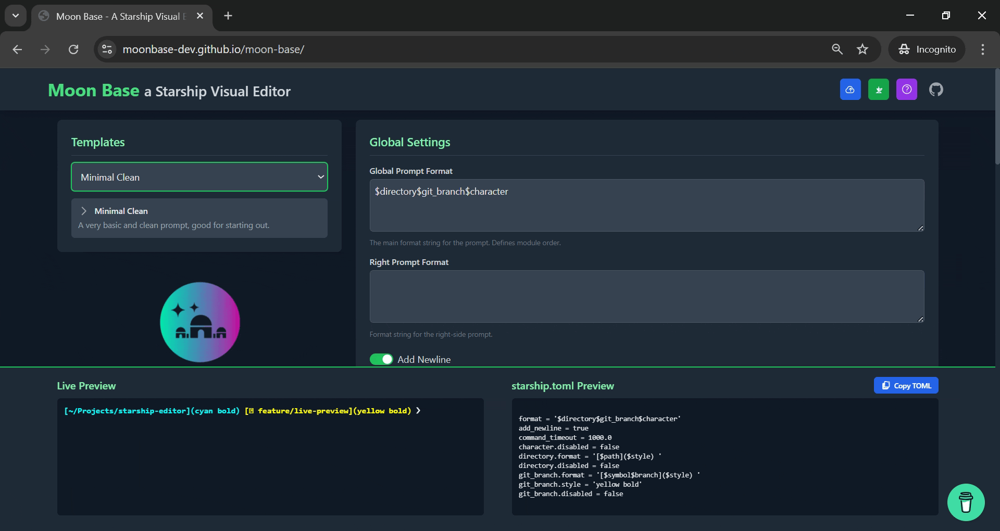
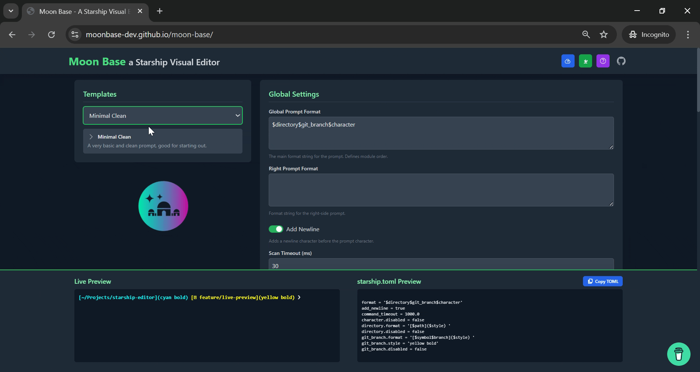
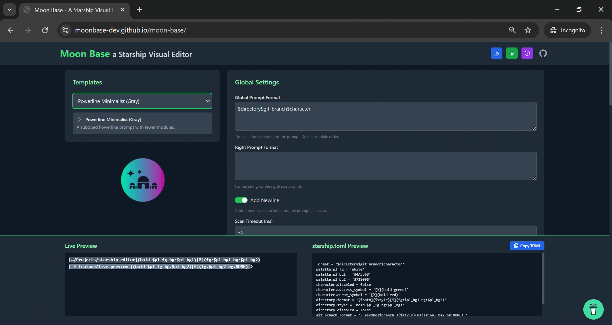
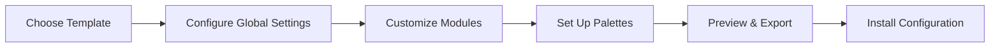

# 🌙 Moon Base

<div align="center">
  
  
  <p align="center">
    <strong>A powerful visual editor for Starship prompt configurations</strong>
  </p>
  
  <p align="center">
    Create, customize, and manage your <a href="https://starship.rs/">Starship</a> prompt configuration files with an intuitive visual interface
  </p>

  <!-- Badges -->
  <p align="center">
    <a href="https://github.com/MoonBase-Dev/moon-base/stargazers">
      
    </a>
    <a href="https://github.com/MoonBase-Dev/moon-base/network/members">
      
    </a>
    <a href="https://github.com/MoonBase-Dev/moon-base/issues">
      
    </a>
    <a href="https://github.com/MoonBase-Dev/moon-base/blob/main/LICENSE">
      
    </a>
  </p>

  <p align="center">
    <a href="https://github.com/MoonBase-Dev/moon-base/releases">
      
    </a>
    <a href="https://github.com/MoonBase-Dev/moon-base/commits/main">
      
    </a>
    <a href="https://github.com/MoonBase-Dev/moon-base/graphs/contributors">
      
    </a>
  </p>

  <p align="center">
    
    
    
    
  </p>

  <!-- Demo & Quick Links -->
  <p align="center">
    <a href="#demo">🎥 View Demo</a> •
    <a href="#installation">🚀 Quick Start</a> •
    <a href="#features">✨ Features</a> •
    <a href="#contributing">🤝 Contributing</a> •
    <a href="https://starship.rs">📚 Starship Docs</a>
  </p>
</div>

---

## 📖 Table of Contents

- [🎯 Overview](#-overview)
- [✨ Features](#-features)
- [🎥 Demo](#-demo)
- [🚀 Installation](#-installation)
- [📖 Usage Guide](#-usage-guide)
- [🎨 Themes & Palettes](#-themes--palettes)
- [🔧 Configuration](#-configuration)
- [🧪 Development](#-development)
- [🤝 Contributing](#-contributing)
- [📋 Changelog](#-changelog)
- [🙏 Acknowledgments](#-acknowledgments)
- [📄 License](#-license)

## 🎯 Overview

Moon Base transforms the way you configure your terminal prompt. Instead of manually editing TOML files, use our intuitive visual interface to create stunning Starship configurations with real-time previews.

### Why Moon Base?

- **🎨 Visual First**: No more guessing how your prompt will look
- **⚡ Real-time**: See changes instantly as you make them  
- **🧩 Module-based**: Enable, disable, and customize individual components
- **🎭 Theme Support**: Built-in support for popular color schemes
- **📱 Responsive**: Works seamlessly across devices
- **🔄 Import/Export**: Easily migrate existing configurations

## ✨ Features

<table>
  <tr>
    <td>
      <h3>🎨 Visual Configuration</h3>
      <p>Edit Starship settings through an intuitive interface without touching TOML syntax</p>
    </td>
    <td>
      <h3>📋 Predefined Templates</h3>
      <p>Quick start with curated templates for different use cases and aesthetics</p>
    </td>
  </tr>
  <tr>
    <td>
      <h3>👁️ Live Preview</h3>
      <p>Real-time visual representation of your prompt as you customize it</p>
    </td>
    <td>
      <h3>⚡ Instant TOML</h3>
      <p>Generated configuration updates in real-time, ready to export</p>
    </td>
  </tr>
  <tr>
    <td>
      <h3>🔧 Module System</h3>
      <p>Enable/disable and fine-tune individual prompt modules with ease</p>
    </td>
    <td>
      <h3>🎨 Palette Manager</h3>
      <p>Create custom color schemes or use popular themes like Nord, Dracula</p>
    </td>
  </tr>
  <tr>
    <td>
      <h3>📁 Import/Export</h3>
      <p>Seamlessly work with existing starship.toml files</p>
    </td>
    <td>
      <h3>📚 Built-in Help</h3>
      <p>Comprehensive documentation and quick links to official resources</p>
    </td>
  </tr>
</table>

## 🎥 Demo

<div align="center">
  
  > **Live Demo**: [Try Moon Base Online](https://moonbase-dev.github.io/moon-base) 🚀
  
  <details>
  <summary>📸 Screenshots</summary>
  
  
  *Main editing interface with live preview*
  
    
  *Detailed module configuration panel*
  
  
  *Built-in theme and palette selection*
  
  </details>
</div>

## 🚀 Installation

### Quick Start (Recommended)

```bash
# Clone the repository
git clone https://github.com/MoonBase-Dev/moon-base.git
cd moon-base

# Install dependencies
npm install

# Start development server
npm run dev
```

### Alternative Methods

<details>
<summary>📦 Download Release</summary>

1. Download the latest release from [GitHub Releases](https://github.com/MoonBase-Dev/moon-base/releases)
2. Extract the archive
3. Open `index.html` in your browser

</details>

<details>
<summary>🐳 Docker</summary>

```bash
# Coming soon!
docker run -p 3000:3000 moonbase/moon-base:latest
```

</details>

### Prerequisites

- **Node.js** 16+ (for development)
- **Modern Browser** (Chrome 90+, Firefox 88+, Safari 14+)
- **Nerd Font** (recommended for symbol display)

## 📖 Usage Guide

### Getting Started

1. **🎯 Project Setup**
   ```bash
   # Ensure assets directory exists
   mkdir -p assets
   # Add your logo as assets/image.png
   cp your-logo.png assets/image.png
   ```

2. **🌐 Launch Application**
   - Open `index.html` in your browser
   - Or start the development server: `npm run dev`

3. **🎨 Choose Your Starting Point**
   - Select a predefined template, or
   - Import your existing `starship.toml`

### Configuration Workflow



<details>
<summary>📋 Detailed Steps</summary>

#### Step 1: Global Settings
Configure top-level prompt behavior:
- **Format String**: Define overall prompt structure
- **Right Prompt**: Set up right-side information
- **Newlines**: Control spacing and layout

#### Step 2: Module Configuration
For each module (git, directory, nodejs, etc.):
- **Toggle**: Enable/disable the module
- **Format**: Customize information display
- **Style**: Set colors and text attributes
- **Properties**: Adjust module-specific settings

#### Step 3: Palette Management
- **Predefined**: Choose from Nord, Dracula, Tokyo Night, etc.
- **Custom**: Create your own color variables
- **Consistency**: Use palette variables across modules

#### Step 4: Export & Install
```bash
# Export generates starship.toml
# Copy to your Starship config location
cp ~/Downloads/starship.toml ~/.config/starship.toml
```

</details>

## 🎨 Themes & Palettes

<table>
  <tr>
    <td align="center">
      <br>
      <strong>Nord</strong>
    </td>
    <td align="center">
      <br>
      <strong>Dracula</strong>
    </td>
    <td align="center">
      <br>
      <strong>Tokyo Night</strong>
    </td>
    <td align="center">
      <br>
      <strong>Gruvbox</strong>
    </td>
  </tr>
  <tr>
    <td align="center">
      <br>
      <strong>Solarized</strong>
    </td>
    <td align="center">
      <br>
      <strong>Catppuccin</strong>
    </td>
    <td align="center">
      <br>
      <strong>One Dark</strong>
    </td>
    <td align="center">
      <br>
      <strong>Custom</strong>
    </td>
  </tr>
</table>

## 🔧 Configuration

### Environment Variables

```bash
# Optional: Custom asset path
MOON_BASE_ASSETS_PATH=./custom-assets

# Optional: Default theme
MOON_BASE_DEFAULT_THEME=nord

# Optional: Enable debug mode
MOON_BASE_DEBUG=true
```

### Browser Support

| Browser | Version | Status |
|---------|---------|--------|
| Chrome  | 90+     | ✅ Full Support |
| Firefox | 88+     | ✅ Full Support |
| Safari  | 14+     | ✅ Full Support |
| Edge    | 90+     | ✅ Full Support |

## 🧪 Development

### Tech Stack

- **Frontend**: React 18 + TypeScript
- **Styling**: Tailwind CSS
- **Build**: Vite
- **Linting**: ESLint + Prettier
- **Testing**: Jest + React Testing Library

### Development Setup

```bash
# Install dependencies
npm install

# Start development server
npm run dev

# Run tests
npm test

# Build for production  
npm run build

# Preview production build
npm run preview
```

### Project Structure

```
moon-base/
├── src/
│   ├── components/       # React components
│   ├── hooks/           # Custom hooks
│   ├── utils/           # Utility functions
│   ├── types/           # TypeScript definitions
│   └── styles/          # CSS and theme files
├── assets/              # Static assets
├── public/              # Public files
└── docs/               # Documentation
```

### Contributing Workflow

1. **🍴 Fork** the repository
2. **🌿 Create** a feature branch: `git checkout -b feature/amazing-feature`
3. **✨ Commit** your changes: `git commit -m 'Add amazing feature'`
4. **🚀 Push** to the branch: `git push origin feature/amazing-feature`
5. **📝 Open** a Pull Request

## 🤝 Contributing

We love contributions! Here's how you can help:

<table>
  <tr>
    <td align="center">
      <h3>🐛 Bug Reports</h3>
      <p>Found a bug? <a href="https://github.com/MoonBase-Dev/moon-base/issues/new?template=bug_report.md">Report it</a></p>
    </td>
    <td align="center">
      <h3>💡 Feature Requests</h3>
      <p>Have an idea? <a href="https://github.com/MoonBase-Dev/moon-base/issues/new?template=feature_request.md">Suggest it</a></p>
    </td>
    <td align="center">
      <h3>📖 Documentation</h3>
      <p>Improve our docs or add examples</p>
    </td>
  </tr>
  <tr>
    <td align="center">
      <h3>🎨 Themes</h3>
      <p>Create new color palettes and themes</p>
    </td>
    <td align="center">
      <h3>🔧 Code</h3>
      <p>Fix bugs or implement new features</p>
    </td>
    <td align="center">
      <h3>🌍 Translations</h3>
      <p>Help us support more languages</p>
    </td>
  </tr>
</table>

### Development Guidelines

- **Code Style**: Follow ESLint + Prettier configuration
- **Commits**: Use [Conventional Commits](https://conventionalcommits.org/)
- **Testing**: Write tests for new features
- **Documentation**: Update README and docs for changes

## 📋 Changelog

### v2.1.0 - Latest

- ✨ Added new theme support (Tokyo Night, Catppuccin)
- 🐛 Fixed module configuration persistence
- 🚀 Improved performance for large configurations
- 📱 Better mobile responsiveness

<details>
<summary>View Full Changelog</summary>

### v2.0.0
- 🎉 Complete UI redesign
- ✨ Live preview functionality
- 🔧 Advanced module configuration

### v1.5.0
- 📦 Template system
- 🎨 Palette management
- 📁 Import/export functionality

### v1.0.0
- 🚀 Initial release
- ⚙️ Basic TOML generation
- 🎯 Core module support

</details>

## 📊 Stats

<div align="center">
  
</div>

## 🔗 Quick Links

- **📚 Documentation**: [Full Docs](https://moonbase-dev.github.io/docs)
- **🎮 Live Demo**: [Try Now](https://moonbase-dev.github.io/moon-base)
- **🐛 Issues**: [Report Bugs](https://github.com/MoonBase-Dev/moon-base/issues)
- **💬 Discussions**: [Join Community](https://github.com/MoonBase-Dev/moon-base/discussions)
- **📧 Contact**: [Get in Touch](mailto:hello@moonbase.dev)

## 💡 Tips & Tricks

<details>
<summary>🔥 Pro Tips</summary>

### Nerd Fonts Setup
For the best experience, install a [Nerd Font](https://www.nerdfonts.com/):
```bash
# Example: Install JetBrains Mono Nerd Font
brew tap homebrew/cask-fonts
brew install font-jetbrains-mono-nerd-font
```

### Format String Magic
```toml
# Use brackets for conditional sections
format = "[on $hostname]($style) "  # Only shows if hostname exists

# Combine variables creatively  
format = "[$symbol$branch]($style) "
```

### Style String Tips
```toml
# Mix colors and attributes
style = "bold green underline"

# Use palette variables for consistency
style = "$primary_color bold"

# Background colors
style = "bg:blue fg:white"
```

</details>

## 🙏 Acknowledgments

Special thanks to these amazing projects and communities:

<table>
  <tr>
    <td align="center">
      <a href="https://starship.rs">
        <br>
        <strong>Starship</strong>
      </a>
    </td>
    <td align="center">
      <a href="https://react.dev">
        <br>
        <strong>React</strong>
      </a>
    </td>
    <td align="center">
      <a href="https://tailwindcss.com">
        <br>
        <strong>Tailwind CSS</strong>
      </a>
    </td>
    <td align="center">
      <a href="https://vitejs.dev">
        <br>
        <strong>Vite</strong>
      </a>
    </td>
  </tr>
  <tr>
    <td align="center">
      <a href="https://claude.ai">
        <br>
        <strong>Claude AI</strong>
      </a>
    </td>
    <td align="center" colspan="3">
      <em>Special thanks to Claude AI for assistance with README formatting and documentation improvements! 🤖✨</em>
    </td>
  </tr>
</table>

### Theme Inspirations
- 🎨 [Dracula Theme](https://draculatheme.com)
- ❄️ [Nord Theme](https://nordtheme.com)  
- 🌸 [Catppuccin](https://catppuccin.com)
- 🌃 [Tokyo Night](https://github.com/enkia/tokyo-night-vscode-theme)

## 📄 License

This project is licensed under the **GPL v3** License - see the [LICENSE](https://github.com/MoonBase-Dev/moon-base/blob/main/LICENSE) file for details.

---

<div align="center">
  
  **Made with ❤️ by the Moon Base team**
  
  <p>
    <a href="https://github.com/MoonBase-Dev/moon-base">⭐ Star us on GitHub</a> • TDOD
    <a href="https://twitter.com/moonbasedev">🐦 Follow on Twitter</a> • TODO
    <a href="https://discord.gg/moonbase">💬 Join Discord</a> TODO
  </p>
  
  <sub>Built for the Starship community 🚀</sub>
  
</div>

---

## 📚 Symbol Reference

<details>
<summary>🎯 Git Symbols</summary>

| Symbol | Unicode | Description | Example Usage |
|--------|---------|-------------|---------------|
| 🌿 | U+1F33F | Git branch (nature) | `symbol = "🌿 "` |
| 🚀 | U+1F680 | Git branch (rocket) | `symbol = "🚀 "` |
| 🌸 | U+1F338 | Git branch (flower) | `symbol = "🌸 "` |
| ⚡ | U+26A1 | Git branch (lightning) | `symbol = "⚡"` |
| 🔥 | U+1F525 | Git status (fire) | `symbol = "🔥"` |
| ⭐ | U+2B50 | Git branch (star) | `symbol = "⭐ "` |

</details>

<details>
<summary>📁 Directory Symbols</summary>

| Symbol | Unicode | Description | Example Usage |
|--------|---------|-------------|---------------|
| 📁 | U+1F4C1 | Folder | `format = "[📁 $path]($style)"` |
| 📂 | U+1F4C2 | Open folder | `format = "[📂 $path]($style)"` |
| 🌌 | U+1F30C | Space/universe | `format = "[🌌 $path]($style)"` |
| 🏠 | U+1F3E0 | Home | `format = "[🏠 $path]($style)"` |

</details>

<details>
<summary>💻 Language/Tool Symbols</summary>

| Symbol | Unicode | Description | Tool |
|--------|---------|-------------|------|
| ⬢ | U+2B22 | Hexagon | Node.js |
| 🐍 | U+1F40D | Snake | Python |
| 🦀 | U+1F980 | Crab | Rust |
| 🐹 | U+1F439 | Hamster | Go |
| ☕ | U+2615 | Coffee | Java |
| 🐳 | U+1F433 | Whale | Docker |

</details>
